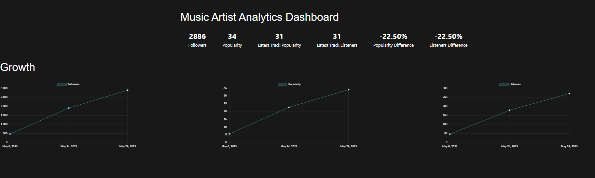

# Spotify Artist Stats

This is a Flask application that fetches and displays various statistics about a Spotify artist using the Spotify Web API. It retrieves data such as followers count, popularity, and listeners for the artist's top tracks. The fetched data is processed and stored in a database for historical tracking.



## Prerequisites

Before running this application, make sure you have the following:

- Python 3.x installed
- Required Python packages installed. You can install them using the following command:

  ```bash
  pip install -r requirements.txt
  ```

## Getting Started

To get started with this application, follow these steps:

1. Clone the repository:

   ```bash
   git clone https://github.com/brandonmathew/spotify-artist-stats.git
   ```

2. Change to the project directory:

   ```bash
   cd spotify-artist-stats
   ```

3. Open the `app.py` file and replace the `client_id` and `client_secret` variables with your own Spotify Developer credentials. If you don't have them, you can create a Spotify Developer account and create a new application to obtain the credentials.

4. Create the necessary database tables by running the following command:

   ```bash
   python database.py
   ```

5. Start the Flask development server:

   ```bash
   python app.py
   ```

6. Open your web browser and visit `http://localhost:5000` to access the application.

## Usage

- On the homepage, you will see basic information about the Spotify artist.
- Click the "Fetch Data" button to fetch the latest data from the Spotify API and store it in the database.
- The fetched data includes the latest track's popularity, number of listeners, and the percentage difference compared to the previous track.
- The historical data is displayed in a table below the latest data.
- The database stores the data for the specific artist, identified by the `artist_id`.
- You can modify the `artist_id` in the code to fetch data for a different artist.

## License

This project is licensed under the MIT License. See the [LICENSE](LICENSE) file for details.

## Acknowledgements

- [Flask](https://flask.palletsprojects.com/) - Python web framework
- [Spotify Web API](https://developer.spotify.com/documentation/web-api/) - API for accessing Spotify data
